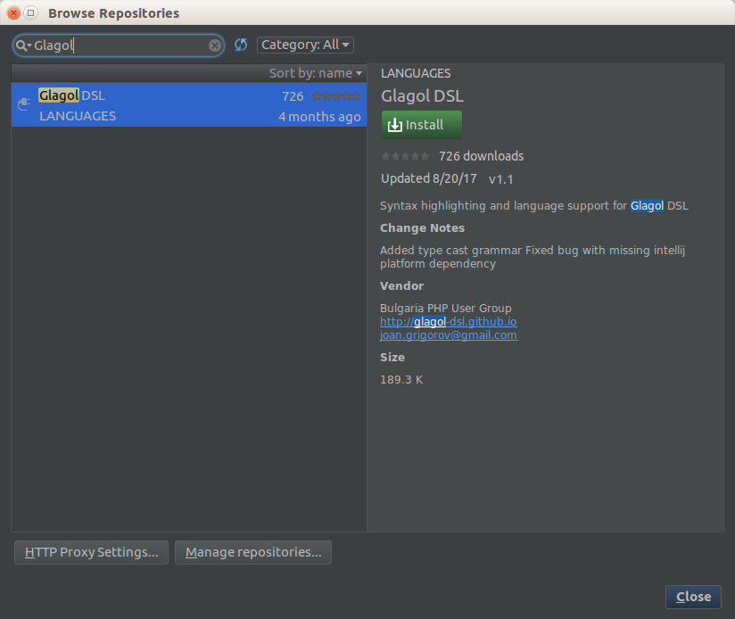

.. _installation:

Installation
============
Before we create a simple Glagol DSL microservice lets setup Glagol DSL!

Prerequisites
-------------

Java
####
Make sure you have java version 1.8 installed before you can use Glagol DSL::

    $ java -version
    java version "1.8.0_151"
    Java(TM) SE Runtime Environment (build 1.8.0_151-b12)
    Java HotSpot(TM) 64-Bit Server VM (build 25.151-b12, mixed mode)

Get the server app
------------------
Download the :code:`glagol-dsl-server-0.6.3.jar` from the `latest release <https://github.com/glagol-dsl/glagol-dsl/releases/latest>`_::

    $ wget https://github.com/glagol-dsl/glagol-dsl/releases/download/0.6.3/glagol-dsl-server-0.6.3.jar ~/glagol-dsl-server.jar

Then you can alias the :code:`glagol-server` as a command so that it can be used easily. To do that you simply add to the end of :code:`~/.bashrc` (or :code:`~/.zshrc`) the following command::

    alias glagol-server='java -Xmx400m -jar /full/path/to/glagol-dsl-server.jar'

And then reload your rc::

    $ source ~/.bashrc

or for zsh::

    $ source ~/.zshrc

Get the client app
-----------------------------
Similarly to the server app the client app jars are available on `Github releases <https://github.com/glagol-dsl/glagol-dsl-client/releases/latest>`_. Download the latest release jar::

    $ wget https://github.com/glagol-dsl/glagol-dsl-client/releases/download/0.3.7/glagol-dsl-client-0.3.7.jar ~/glagol-dsl-client.jar

Then you can alias the :code:`glagol` as a command so that it can be used easily. To do that you simply add to the end of :code:`~/.bashrc` (or :code:`~/.zshrc`) the following command::

    alias glagol='java -jar /full/path/to/glagol-dsl-client.jar'

.. attention::

    When using the client as of version >= 0.4, for now you have to run compile with the `-l` (--no-ssh-auth) flag until the ssh feature is completed.

And then reload your rc::

    $ source ~/.bashrc

or for zsh::

    $ source ~/.zshrc

Start the Glagol DSL server
---------------------------
Glagol DSL server app can be initiated using the following command::

    $ glagol-server daemon

The expected output is the following::

    Initializing Glagol...
    Daemon listens on port 51151...

The initialization phase might take up to 10 seconds depending on your machine's performance. You need to keep the Glagol DSL server running if you wish to compile.

Next section will explain more about setting up an initial project structure, compiling and running an app.

Get the IDE plugin
------------------
Glagol DSL supports an IntelliJ IDEA (PhpStorm, WebStorm, etc.) plugin. You can find in in the `JetBrains repositories <https://plugins.jetbrains.com/plugin/9869-glagol-dsl>`_ .

